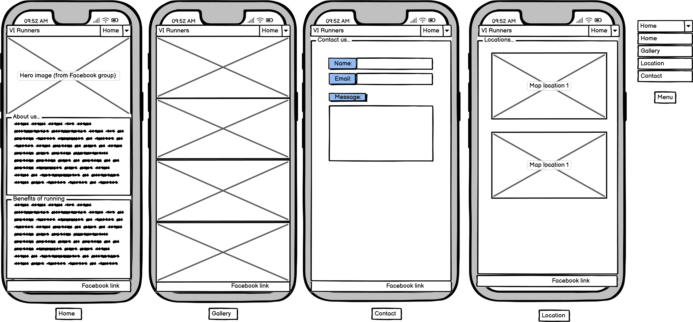
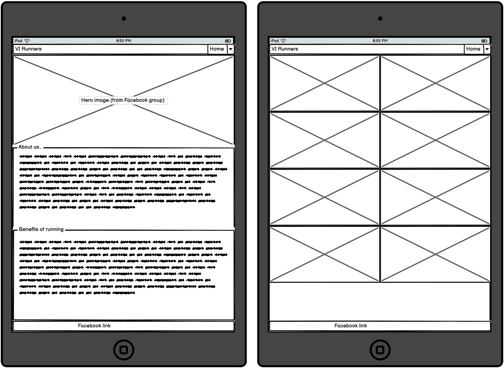
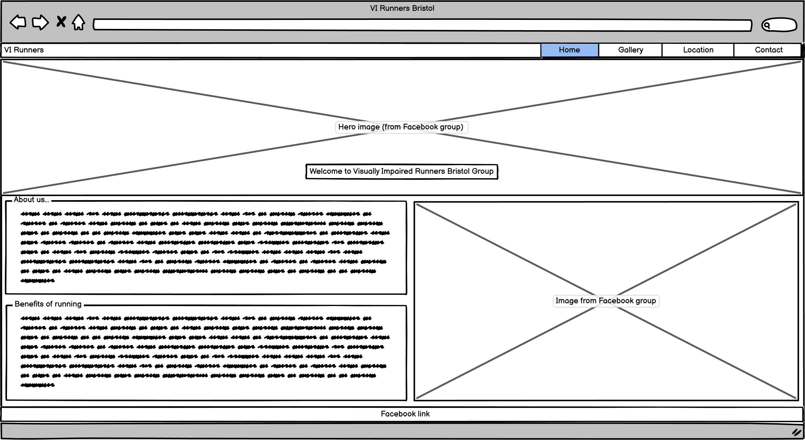

# VI Runners Bristol

Overview
Welcome to the website of VI Runners Bristol, a community group for visually impaired runners from Bristol, UK. 
This website serves as an informative platform for existing and prospective members to learn more about our activities, benefits of running, and how to join us.

The idea is for the site to be accessible for visually impaired users, the background color used was white (#FFFFFF) and the font color was black (#000000) for the main content.
For the tile and heading used blue (#0000FF). This provides a high contrast ratio of 21:1, provided by [WebAIM](https://webaim.org/resources/contrastchecker/?fcolor=0000FF&bcolor=FFFFFF)

  

Website Link
Visit the [VI Runners Bristol Website](https://carlos-n21.github.io/p1-vi-runners/)

Facebook Group
This website website is based on our active Facebook group: [VI Runners Bristol Facebook Group](https://www.facebook.com/groups/1890506954520150/)

Development Details
Coded with: Copilot AI assistance and Bootstrap framework.

Initial Layout: Created using Balsamiq wireframes.

  - [Wireframe File](readme-files/VI-Runners.bmpr)

  - 
  -  
  - 

Fonts Used: Roboto, Oswald, sans-serif.

Design: High contrast ratio with a white background and black text, complemented by blue titles and headings for readability and visual appeal.

Content Source
The content on this site has been sourced from our Facebook page, as we are currently unable to generate realistic images using AI.

Pages Overview
1. Home
Has a hero image for the group

About us: Brief introduction to VI Runners Bristol and how the group works.

Running Benefits: Short list of overall physical and mental health benefits of running.

2. About
Links to the "About us" part on the home page, links to "Welcome" area of home page

3. Gallery
Images: A collection of images showcasing our group activities, from runs to social gatherings.

4. Location
Meeting Points: Information on where we meet, including embedded Google Maps for easy navigation.

5. Contact
Contact Form: A simple form to get in touch with us for more information or to join the group.

Validator Testing 

- HTML
  - Various errors were shown during validation, related to aria-describedby to try to add more information for screen reader tools, these were not able to be changed as not enough knowledge about it and what tools can be used, searched but not found much information [W3C validator](https://validator.w3.org/nu/?doc=https%3A%2F%2Fcode-institute-org.github.io%2Flove-running-2.0%2Findex.html)
- CSS
  - No errors were found when passing through the official [(Jigsaw) validator](https://jigsaw.w3.org/css-validator/validator?uri=https%3A%2F%2Fvalidator.w3.org%2Fnu%2F%3Fdoc%3Dhttps%253A%252F%252Fcode-institute-org.github.io%252Flove-running-2.0%252Findex.html&profile=css3svg&usermedium=all&warning=1&vextwarning=&lang=en#css)

During verification had 

Each page has a Facebook link on the footer for the Group Page, offering the user the possiblity to get further information and a way to communicate with the group and its members. This a group open to the public.

Each page performance can be checked with the following PDF files.

  - [Home performance](readme-files/Home performance.pdf) 
  - [Gallery performance](readme-files/Gallery performance.pdf) 
  - [Location performance](readme-files/Location performance.pdf) 
  - [Contact performance](readme-files/Contact performance.pdf)

Contributing
We welcome contributions from members of the Facebook Group mentioned above and the community. 
Feel free to fork the repository and submit pull requests.

License
No licensing at the moment.

Credits
Website Development: Carlos N.

Copilot AI Assistance: Provided intelligent code suggestions.

Bootstrap: CSS framework for responsive design.

Content: Sourced from the VI Runners Bristol Facebook group.

