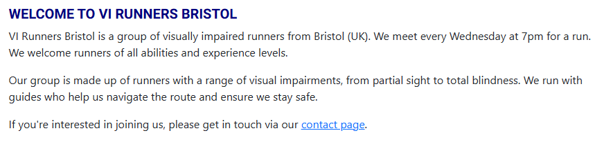
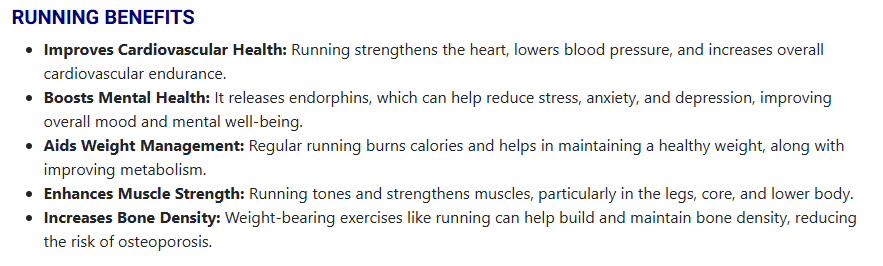
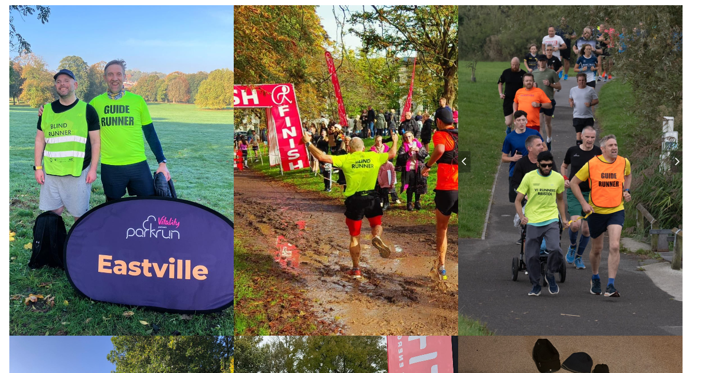
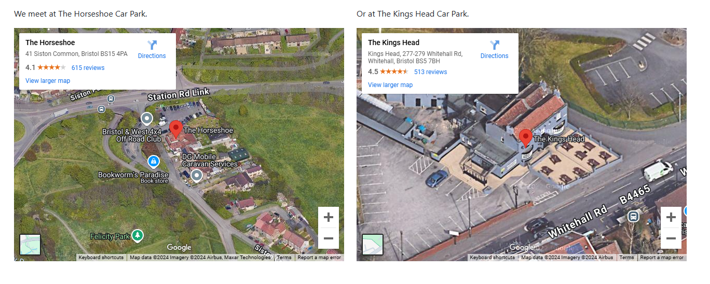
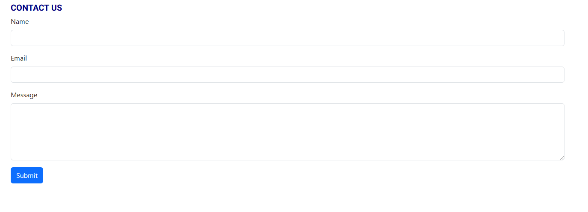
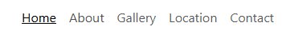
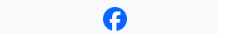

# VI Runners Bristol

[VI Runners Bristol Website](https://carlos-n21.github.io/p1-vi-runners/)  
  

Overview:
Welcome to the website of VI Runners Bristol, a community group for visually impaired runners from Bristol, UK. 
This website serves as an informative platform for existing and prospective members to learn more about our activities, benefits of running, and how to join us.

Facebook Group:
This website website is based on our active Facebook group: [VI Runners Bristol Facebook Group](https://www.facebook.com/groups/1890506954520150/)

Development Details
Coded with: Copilot AI assistance and Bootstrap framework.

Layout: Created using Balsamiq wireframes.

  - [Wireframe File](readme-files/VI-Runners.bmpr)

  
  
  

Fonts Used: Roboto, Oswald, sans-serif.

The idea is for the site to be accessible for visually impaired users, the background color used was white (#FFFFFF) and the font color was black (#000000) for the main content.
For the tile and heading used blue (#0000FF). This provides a high contrast ratio of 21:1 for the main content. Provided by [WebAIM](https://webaim.org/resources/contrastchecker/?fcolor=0000FF&bcolor=FFFFFF)

Content Source
The content on this site has been sourced from the group Facebook page, as AI was unable to generate realistic images using AI as shown below:

 

Pages Overview
1. Home
Has a hero image for the group

About us: Brief introduction to VI Runners Bristol and how the group works.

Running Benefits: Short list of overall physical and mental health benefits of running.

2. About
Links to the "About us" part on the home page.

3. Gallery
Images: A collection of images showcasing our group activities, from runs to social gatherings.

4. Location
Meeting Points: Information on where we meet, including embedded Google Maps for easy navigation.

5. Contact
Contact Form: A simple form to get in touch with us for more information or to join the group.

All pages have same title, navbar and footer for consistency. Footer only has one link for Facebook as this group is not using other social networks.
These can be added in the future.

   

Languages used to build the webpage:
- HTML
- CSS
- Bootsrap classes

Validator Testing 

- HTML
  - Various errors were shown during validation, related to aria-describedby to try to add more information for screen reader tools, these were not able to be changed as not enough knowledge about it and what tools can be used, searched but not found much information [W3C validator](https://validator.w3.org/nu/?doc=https%3A%2F%2Fcode-institute-org.github.io%2Flove-running-2.0%2Findex.html)
- CSS
  - No errors were found when passing through the official [(Jigsaw) validator](https://jigsaw.w3.org/css-validator/validator?uri=https%3A%2F%2Fvalidator.w3.org%2Fnu%2F%3Fdoc%3Dhttps%253A%252F%252Fcode-institute-org.github.io%252Flove-running-2.0%252Findex.html&profile=css3svg&usermedium=all&warning=1&vextwarning=&lang=en#css)

Each page performance can be checked with the following PDF files.

  - [Home performance](readme-files/Home performance.pdf) 
  - [Gallery performance](readme-files/Gallery performance.pdf) 
  - [Location performance](readme-files/Location performance.pdf) 
  - [Contact performance](readme-files/Contact performance.pdf)

Contributing
We welcome contributions from members of the Facebook Group mentioned above and the community. 
Feel free to fork the repository and submit pull requests.

Future features:
- Get contact form to work properly by creating an email for the group after discussion with members or take this feature and have communication done via Facebook page
- Add more interactivity to the site, pending accessibility evaluation and impact on visually impaired users, if meaningful
- Add comments/reviews area/page for other users to see how group members feel about it
- Create backend part of the website and make it usable by non-coders.
- Search for accessibility tools to improve screen reader information for VI users
- Add other features that group users can find usefull for them

Credits
Website Development: Carlos N.

Copilot AI Assistance: Provided intelligent code suggestions.

Bootstrap: CSS framework for responsive design.

Content: Sourced from the VI Runners Bristol Facebook group.

